# Verify AI — Identity Document Fraud Detection Platform

<p align="center">
  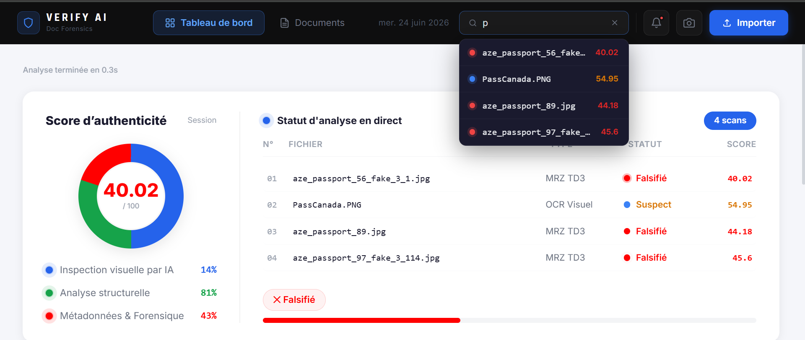
</p>

<p align="center">
  <strong>Multi-layer forensic analysis for passports, ID cards, and driving licences</strong><br>
  CNN visual inspection · MRZ / OCR structural checks · EXIF & image forensics
</p>

<p align="center">
  <a href="https://github.com/hadil51/Verify-AI"></a>
  
  
  
  
</p>

---

## Overview

**Verify AI** is an end-to-end platform that estimates the authenticity of identity documents from a single upload or live camera capture. Instead of relying on one signal, it runs three complementary analysis layers in parallel and fuses them into a clear verdict:

| Layer | What it checks | Typical signals |
| --- | --- | --- |
| **Visual AI inspection** | ResNet50 classifier + explainability | Real / falsified label, Grad-CAM, LIME, suspicious regions |
| **Structural analysis** | MRZ (TD3), OCR fields, typography | ISO 7501 checksums, field consistency, font & alignment |
| **Metadata & forensics** | File / pixel integrity | EXIF anomalies, ELA, double JPEG compression, noise |

The UI surfaces a **global authenticity score (0–100)**, a verdict (`Authentic` / `Suspicious` / `Fake`), extracted identity fields, and operator-friendly forensic detail.

> Academic / engineering project (PFA) built for portfolio demonstration. Not a production KYC system.

---

## Key features

- **Upload or capture** — file import and webcam capture with automatic document framing  
- **Live multi-step pipeline** — OCR/MRZ, CNN, fonts, metadata, and field extraction with progress feedback  
- **Session dashboard** — authenticity gauge, scan history, search, and batch status  
- **Documents gallery** — thumbnail library of analysed scans for the current session  
- **Explainable AI** — forgery map, Grad-CAM heatmaps, and LIME superpixels  
- **Forensic scoring** — EXIF, Error Level Analysis (ELA), double compression, noise anomalies  
- **MRZ validation** — TD3 parsing and ISO 7501 checksum verification when an MRZ is present  

---

## Architecture

```text
┌─────────────────────┐     POST /analyze      ┌──────────────────────────────┐
│  React + TypeScript │ ─────────────────────► │  FastAPI orchestration       │
│  Vite · Tailwind    │ ◄───────────────────── │  concurrent ThreadPool       │
└─────────────────────┘     JSON result         └──────────────┬───────────────┘
                                                               │
              ┌────────────────┬─────────────────┬─────────────┴─────────────┐
              ▼                ▼                 ▼                           ▼
        cnn_module       ocr_module        font_module              metadata_module
        (ResNet50)       + MRZ / fields    (typography)             (EXIF · ELA · …)
              │                │                 │                           │
              └────────────────┴─────────────────┴───────────────────────────┘
                                       │
                                       ▼
                         Weighted global score + verdict
```

**Score fusion (when MRZ is found):**

- Visual AI → **50%**
- Structural (MRZ + fields + font) → **30%**
- Metadata & forensics → **20%**

Weights shift slightly when no MRZ is detected (stronger visual / field reliance).

**Verdict thresholds:** `≥ 75` Authentic · `50–74` Suspicious · `< 50` Fake.

---

## Tech stack

| Area | Stack |
| --- | --- |
| Frontend | React 19, TypeScript, Vite, Tailwind CSS |
| Backend | Python, FastAPI, Uvicorn |
| Computer vision / ML | TensorFlow / Keras (ResNet50), OpenCV, PassportEye, EasyOCR / Tesseract |
| Forensics | EXIF, ELA, JPEG compression / noise heuristics |
| Ops | Model auto-download via `gdown`, result caching, GZip |

---

## Model performance

ResNet50 identity-document classifier (held-out test set):

| Metric | Value |
| --- | --- |
| Accuracy | **89.5%** |
| Real — F1 | 0.88 |
| Fake — F1 | 0.91 |
| Dataset | ~2.2k images (real + forged) |

Training artefacts and Grad-CAM examples live under `PFA_FIN/backend/ID_Project/results/`.

---

## Product walkthrough

Screenshots below follow a real analysis session. The full set is in [`images/`](images/).

### 1 — Import a document

<p align="center">
  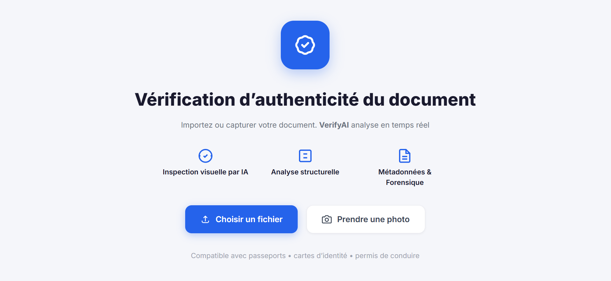
</p>

### 2 — Live camera capture

<p align="center">
  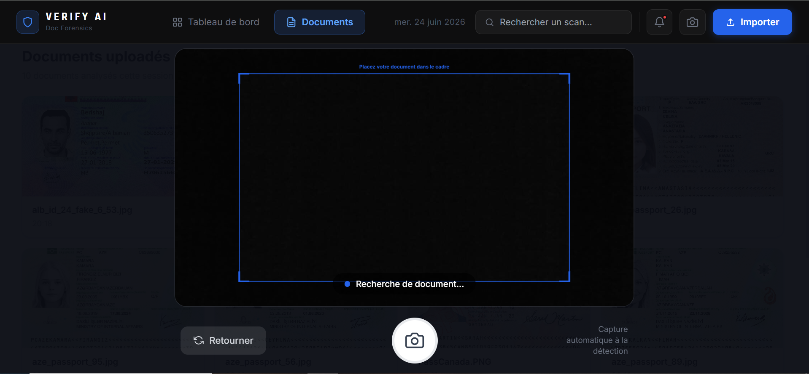
</p>

### 3 — Pipeline in progress

<p align="center">
  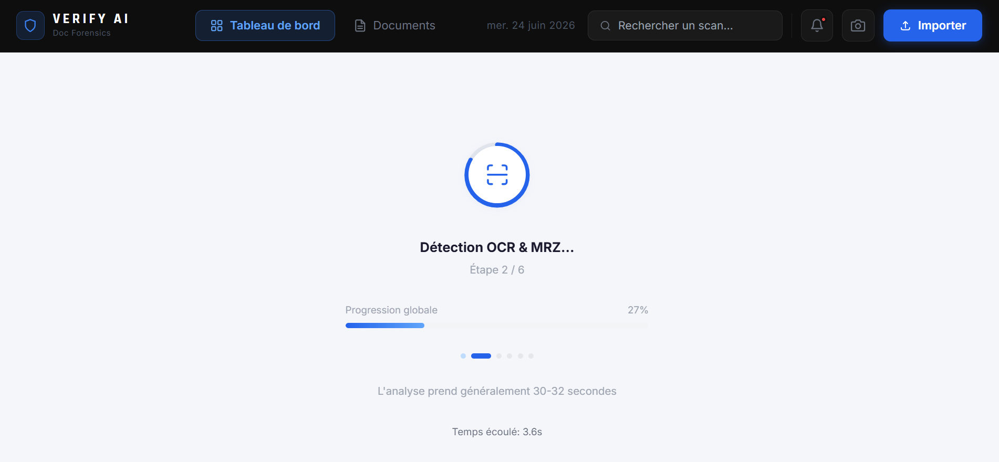
</p>

### 4 — Dashboard authenticity score

<p align="center">
  
</p>

### 5 — Documents gallery

<p align="center">
  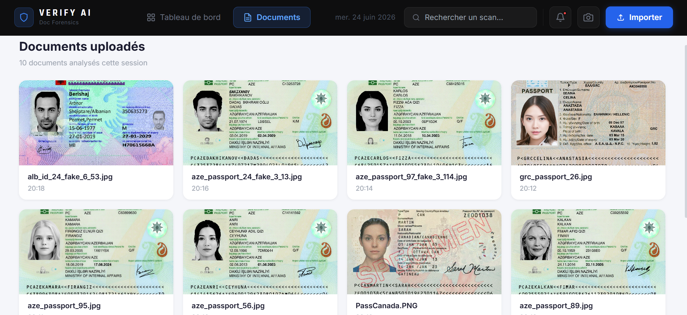
</p>

### 6 — Overview verdict & extracted identity

<p align="center">
  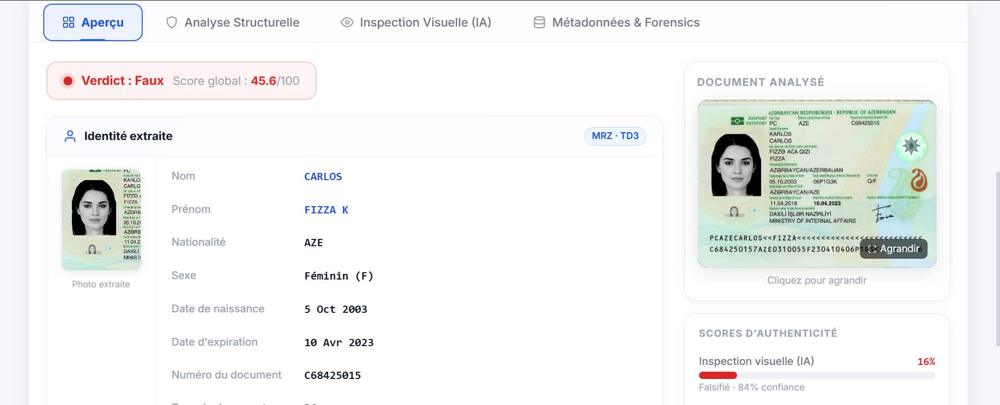
</p>

<p align="center">
  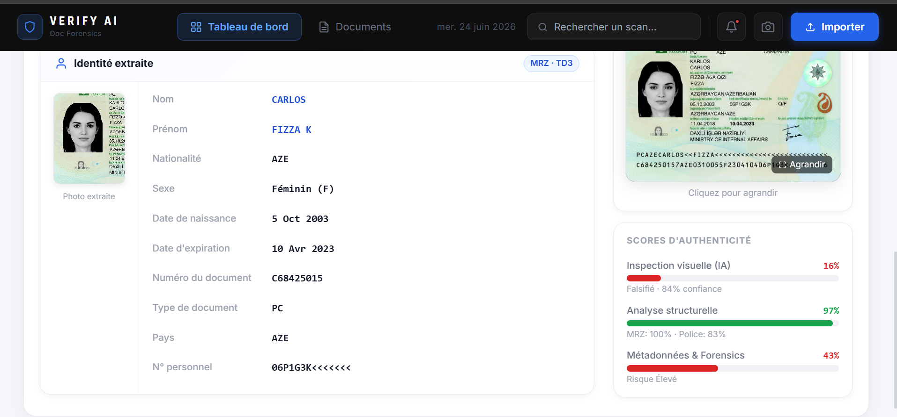
</p>

### 7 — Structural analysis (MRZ · ISO 7501)

<p align="center">
  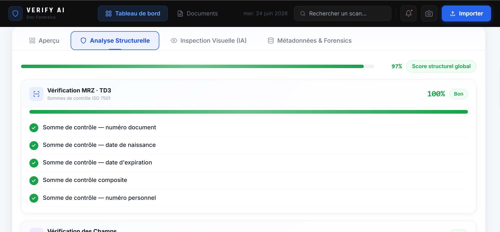
</p>

### 8 — Font & alignment forensics

<p align="center">
  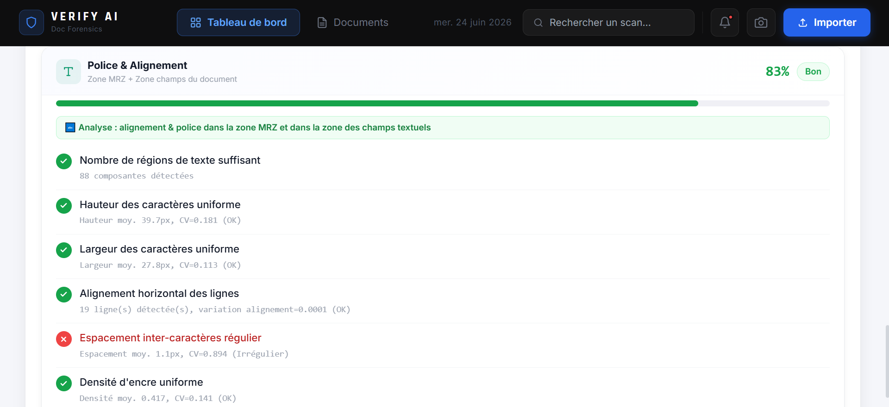
</p>

### 9 — Visual AI explainability

<p align="center">
  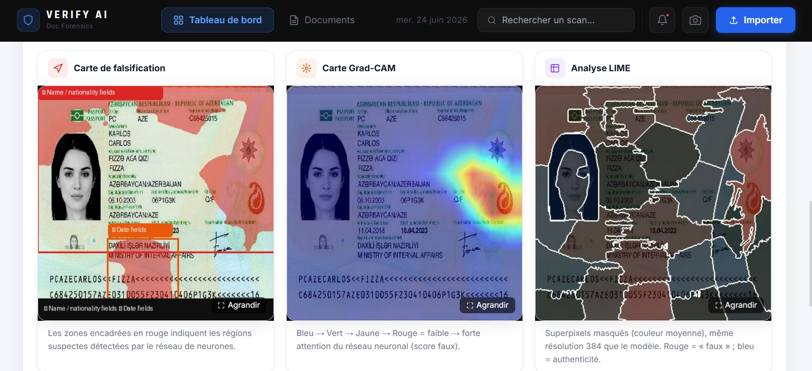
</p>

### 10 — Metadata & pixel forensics

<p align="center">
  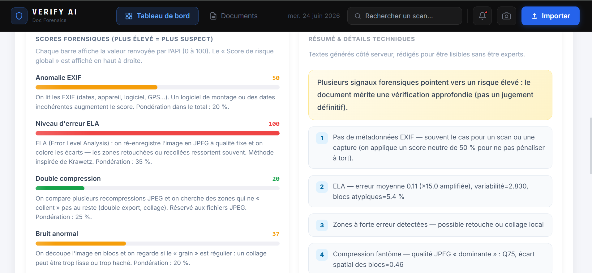
</p>

---

## Project structure

```text
VerifyAI_PFA/
├── images/                 # UI walkthrough screenshots (README gallery)
├── PFA_FIN/
│   ├── backend/
│   │   ├── main.py         # FastAPI app · /analyze endpoint
│   │   ├── pipeline.py     # Concurrent fusion of all modules
│   │   ├── cnn_module.py
│   │   ├── ocr_module.py · ocr_fields_module.py · doc_fields_module.py
│   │   ├── font_module.py · metadata_module.py
│   │   ├── ocr_engine/     # MRZ helpers
│   │   ├── templates/      # Layout / field helpers
│   │   ├── ID_Project/     # Training logs, metrics, Grad-CAM samples
│   │   └── requirements.txt
│   └── frontend/           # React + Vite application
└── README.md
```

---

## Getting started

### Prerequisites

- Python **3.10+**
- Node.js **18+**
- Tesseract OCR installed and available on `PATH` (required by OCR modules)

### Backend

```bash
cd PFA_FIN/backend
python -m venv venv

# Windows
venv\Scripts\activate
# macOS / Linux
# source venv/bin/activate

pip install -r requirements.txt
uvicorn main:app --reload --port 8000
```

On first start, the ResNet50 weights are downloaded automatically if missing (`AUTO_DOWNLOAD_MODEL=1`).

API docs: [http://127.0.0.1:8000/docs](http://127.0.0.1:8000/docs)

### Frontend

```bash
cd PFA_FIN/frontend
npm install
npm run dev
```

Open the URL printed by Vite (usually `http://127.0.0.1:5173`).

---

## API (summary)

| Method | Path | Description |
| --- | --- | --- |
| `POST` | `/analyze` | Multipart image upload → full forensic JSON result |

Response highlights: `global_score_display`, `verdict`, `cnn`, `ocr`, `font`, `metadata`, `performance`.

---


## Author

**Hadil** — Software / AI engineering · Portfolio project  

Repository: [github.com/hadil51/Verify-AI](https://github.com/hadil51/Verify-AI)
